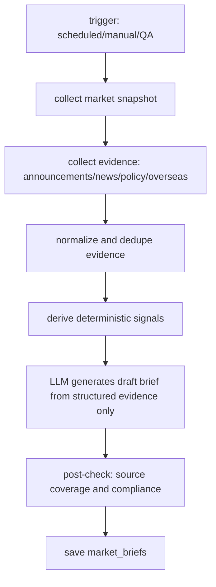

# 市场情报采集与盘前简报设计

> 本 spec 规划一个新增能力：市场情报采集与盘前/早盘简报。
> 目标是把指数、成交、市场宽度、板块强弱、公告、政策和外围市场信息
> 组织成一份可追溯、可降级、可被 LangGraph 问答复用的结构化市场简报。

## 1. 背景

当前项目已经具备：

- 基金 NAV、阶段指标、自选池、持仓和 PnL。
- 主要指数本地快照：`market_service.refresh_market()` / `get_indices()`。
- 基金体检、同类候选、LangGraph QA、主动 `lookup_fund_auto` / `diagnose_fund_auto`。
- 定时刷新和手动刷新能力。

但当前系统对“市场环境”的理解仍很弱：

- 只能看到少量指数，没有市场宽度、涨跌停、成交额、板块热度。
- 没有把政策、公告、外围市场、题材催化沉淀为结构化证据。
- QA 虽然可以主动刷新基金数据，但还不能主动收集市场情报。
- 用户想要的是类似“盘前/早盘分析”的信息产品，而不是单条行情查询。

这类能力难点不在 UI，而在数据可信度和证据链：如果让 LLM 直接生成“主线逻辑”，容易编造催化、过度归因或给出交易指令。因此本阶段采用“先采集证据，再生成简报”的架构。

## 2. 目标

新增“市场情报简报”能力，输出类似：

- 指数表现：沪指、深成指、创业板、科创 50、成交额。
- 赚钱效应：上涨/下跌家数、涨停/跌停、炸板率、连板高度。
- 主线板块：强势板块、弱势板块、异动细分、可能催化。
- 政策与制度消息：政策原文/权威新闻的摘要和影响方向。
- 晚间公告：重点公告的摘要、标的、事件类型。
- 外围市场：美股、港股、原油、汇率等对 A 股情绪的影响。
- 盘前观察信号：需要观察的 2-5 个客观变量。
- 风险提示：高位拥挤、情绪退潮、外围反转、数据缺失等。

输出必须满足：

- 每个判断尽量绑定 `source`、`source_url`、`published_at` 或 `as_of`。
- 无法验证的催化不写成事实，只写成“待确认”或不输出。
- 不生成强制交易指令，不写“必须买/立刻卖/满仓”等内容。
- 可以写“观察框架”“风险阈值”“可能受益方向”，但要标明这是信息整理，不是投资建议。

## 3. 范围

本阶段包含：

- 市场快照采集：指数、成交额、涨跌家数、涨跌停、板块涨跌。
- 事件采集：公告、政策、财经新闻、外围市场。
- 结构化存储：把原始证据、标准化指标、生成后的简报分层保存。
- 简报生成服务：基于证据生成 `pre_market` / `morning` / `post_market` 三类简报。
- API：查询最新简报、触发采集、查看采集状态。
- 前端：新增“市场简报”页面或首页模块。
- LangGraph：新增 market briefing tool，QA 可回答“今天盘前怎么看/市场主线是什么”。

v1 实现范围收窄：

- Phase A 只做行情简报骨架：指数、成交额、涨跌家数、涨跌停、板块强弱、风险提示。
- Phase A 不接新闻/政策自动抓取，不生成“政策催化”段落。
- Phase A 可以保留手动 evidence 入口，但自动简报不依赖它。
- LLM 在 Phase A 只做措辞整理，不负责发现主线；主线候选由确定性信号先算出。

本阶段不包含：

- 实时逐笔行情。
- 自动交易、仓位指令或明确个股买卖建议。
- 高频爬虫或绕过站点限制的数据抓取。
- 付费资讯源接入。
- 完整研报 RAG。
- 多用户权限和生产级任务队列。

## 4. 产品行为

### 4.1 简报类型

`pre_market`：盘前简报。

- 生成时间建议：交易日 08:30-09:15。
- 数据窗口：上一交易日 A 股行情 + 隔夜外围市场 + 盘前新闻/公告。
- 重点回答：今天开盘前需要看什么。

`morning`：早盘简报。

- 生成时间建议：交易日 10:00-11:30。
- 数据窗口：当日上午指数、成交、涨跌家数、板块异动。
- 重点回答：早盘资金正在往哪里切。

`post_market`：收盘复盘。

- 生成时间建议：交易日 15:30-18:00。
- 数据窗口：全天行情、板块、涨跌停、公告预告。
- 重点回答：今天发生了什么，明天需要观察什么。

v1 优先实现 `pre_market` 和手动触发；`morning/post_market` 复用同一数据模型，后续扩展。

### 4.2 交易日与数据窗口语义

`trade_date` 表示简报服务想要描述的 A 股交易日。

`pre_market`：

- A 股行情窗口：上一交易日收盘数据。
- 公告/政策窗口：上一交易日 15:00 后到 `trade_date` 09:15 前。
- 外围市场窗口：上一自然日美股/商品/汇率收盘或最新可用数据。
- 如果无法识别上一交易日，使用本地已有最新 A 股快照，并在 `missing_data` 中加入 `trade_calendar`。

`morning`：

- A 股行情窗口：`trade_date` 当日开盘后到采集时刻。
- 板块、涨跌家数、涨跌停按采集时刻快照计算。
- 早盘数据天然会过期，生成后超过 30 分钟标记为 `stale`。

`post_market`：

- A 股行情窗口：`trade_date` 全天收盘数据。
- 公告窗口：`trade_date` 15:00 后公告先作为“盘后跟踪”，不强行解释成当天行情原因。

### 4.3 用户入口

前端：

- 首页新增“市场简报”卡片：展示最新 `pre_market` 摘要、生成时间、数据完整度。
- 新增 `/briefing` 页面：展示完整简报、证据来源、刷新按钮、缺失数据。
- 自选池/基金详情页可显示“市场环境摘要”，但不在 v1 强塞进所有页面。

QA：

- 用户问“今天盘前怎么看”“早盘主线是什么”“医药为什么涨”“高位 AI 是不是退潮”时，调用 `get_market_briefing` 或 `refresh_market_briefing`。
- 回答必须引用简报里的证据，不允许 LLM 单独编写未采集的新闻或公告。

## 5. 输出结构

简报主结构：

```json
{
  "brief_id": "2026-07-07-pre_market",
  "brief_type": "pre_market",
  "trade_date": "2026-07-07",
  "generated_at": "2026-07-07T08:45:00+08:00",
  "status": "ready",
  "confidence": "medium",
  "data_quality": "partial",
  "summary": "指数分化、赚钱效应偏弱，资金从高位科技向低位医药和高股息防御切换。",
  "sections": [
    {
      "key": "index_performance",
      "title": "指数表现",
      "bullets": ["沪指 -0.06%，深成指 -1.16%，创业板 -1.77%，科创50 +1.04%。"],
      "evidence_ids": ["mkt_idx_001"]
    }
  ],
  "watch_signals": [
    {
      "label": "医药能否扩散",
      "metric": "创新药板块成交额和涨停数",
      "direction": "higher_is_stronger"
    }
  ],
  "risks": [
    "高位算力和光通信继续放量下跌可能拖累成长风格。"
  ],
  "missing_data": ["northbound_flow"],
  "source": "akshare+public_news",
  "as_of": "2026-07-07"
}
```

`data_quality` 取值：

- `complete`：核心行情、市场宽度、板块、涨跌停、外围和事件证据都可用。
- `partial`：核心行情、市场宽度、板块、涨跌停可用，但新闻/公告/外围部分缺失。
- `market_only`：只有指数或全 A 快照，无法生成板块和事件归因。
- `failed`：核心行情缺失，只返回错误和缺失数据，不生成正式简报。

回答强度约束：

- `complete`：可以生成完整简报。
- `partial`：可以生成行情和板块简报，政策/新闻催化必须谨慎。
- `market_only`：只能描述指数和赚钱效应，不写主线板块逻辑。
- `failed`：不生成观点，只提示数据缺失和可重试动作。

证据结构：

```json
{
  "evidence_id": "news_001",
  "category": "policy",
  "title": "国家药监局发布 CGT 审评征求意见稿",
  "summary": "拟将部分细胞基因治疗新药纳入快速审评通道。",
  "symbols": ["创新药", "细胞治疗"],
  "source": "NMPA",
  "source_url": "https://...",
  "published_at": "2026-07-06T20:12:00+08:00",
  "collected_at": "2026-07-07T08:30:00+08:00",
  "reliability": "official",
  "raw_excerpt": "短摘录，不保存整篇文章"
}
```

## 6. 数据分层

### 6.1 原始证据层

表：`market_evidence`

字段建议：

- `id`
- `trade_date`
- `brief_type`
- `category`：`index | breadth | sector | limit_up | announcement | policy | news | overseas | commodity`
- `title`
- `summary`
- `symbols_json`
- `metrics_json`
- `source`
- `source_url`
- `published_at`
- `collected_at`
- `reliability`：`official | exchange | data_vendor | media | unknown`
- `raw_excerpt`
- `raw_hash`

原则：

- 不保存长篇新闻全文，避免版权和存储膨胀。
- 保存短摘要、链接、发布时间和 hash，保证可追溯。
- 同一 URL 或同一 hash 去重。

### 6.2 标准化快照层

表：`market_snapshots`

字段建议：

- `trade_date`
- `snapshot_type`：`pre_market | morning | post_market`
- `index_json`
- `breadth_json`
- `sector_json`
- `limit_up_json`
- `overseas_json`
- `source`
- `as_of`
- `missing_data_json`

### 6.3 简报层

表：`market_briefs`

字段建议：

- `brief_id`
- `brief_type`
- `trade_date`
- `status`
- `confidence`
- `summary`
- `sections_json`
- `watch_signals_json`
- `risks_json`
- `missing_data_json`
- `evidence_ids_json`
- `model`
- `prompt_version`
- `generated_at`
- `source`
- `as_of`

## 7. 数据源设计

### 7.1 AkShare / 行情数据

优先使用现有 AkShare 生态，失败时降级：

| 信息 | 主数据源 | 计算方式 | 缺失降级 |
| --- | --- | --- | --- |
| 指数表现 | `stock_zh_index_spot_em` | 过滤上证、深成指、创业板、科创 50、沪深 300，读取最新价和涨跌幅 | 保留已有 `market_data` 最新缓存；仍无则 `market_only/failed` |
| 成交额 | `stock_zh_a_spot_em` | 对全 A `成交额` 求和，单位统一为亿元 | 缺失则不展示成交额变化 |
| 涨跌家数 | `stock_zh_a_spot_em` | 按 `涨跌幅 > 0 / < 0 / = 0` 统计上涨、下跌、平盘 | 缺失则不生成赚钱效应段落 |
| 涨停池 | `stock_zt_pool_em` | 统计涨停数量、行业/概念集中度、代表股票 | 缺失则涨停数显示 `--` |
| 跌停池 | `stock_zt_pool_dtgc_em` 或可用跌停池接口 | 统计跌停数量和风险方向 | 缺失则不计算涨跌停比 |
| 炸板池 | `stock_zt_pool_zbgc_em` | 统计炸板数量，炸板率 = 炸板 / (涨停 + 炸板) | 缺失则不写“炸板率偏高” |
| 强势股池 | `stock_zt_pool_strong_em` | 辅助判断连板和短线情绪 | 缺失则不写连板高度 |
| 行业板块 | `stock_board_industry_name_em` | 按涨跌幅、成交额、涨停数排序 | 缺失则不写行业强弱 |
| 概念板块 | `stock_board_concept_name_em` | 按涨跌幅、成交额、涨停数排序 | 缺失则只展示行业板块 |
| 板块异动 | `stock_board_change_em` | 作为盘中异动参考，只用于 `morning` | 缺失不影响盘前简报 |
| 商品 | `futures_global_spot_em` / `futures_global_hist_em` | 读取原油、黄金等涨跌 | 缺失则外围市场标记缺失 |
| 汇率 | `currency_latest` | 读取美元/人民币等关键汇率 | 缺失则不写汇率影响 |

注意：AkShare 接口名称和字段经常变化。实现时每个采集器必须：

- 有字段兼容层。
- 捕获异常并返回 `{error, source}`。
- 单个源失败不影响整份简报生成。

### 7.2 公告与政策新闻

公告：

- v1 可从交易所公告、巨潮资讯、东方财富公告接口中选择一个稳定源；AkShare 候选为 `stock_notice_report`、`stock_individual_notice_report`。
- 只采集标题、股票代码、公告类型、发布时间、URL、简短摘要。

政策/新闻：

- v1 不建议一开始做全网新闻爬虫。
- 优先支持“白名单来源”：
  - 证监会、交易所、国家部委官网。
  - 东方财富/证券时报/财联社等公开页面或 RSS（如可用）。
- AkShare 候选为 `stock_news_em`、`news_cctv`、`news_economic_baidu`，这类来源只能作为新闻线索，重要政策仍以官方 URL 为准。
- 每条新闻保存 `source_url` 和 `published_at`。
- LLM 只能对已采集的证据做归纳，不允许补写没有证据的政策催化。

### 7.3 手动补充入口

为了让 v1 可用，可以保留一个手动证据入口：

```http
POST /api/market/evidence
```

用户可以把外部新闻标题/链接/摘要贴进系统，系统结构化保存并参与简报生成。

这个入口比“让系统一开始自动搜全网”更稳，也便于早期验证简报模板质量。

## 8. 生成流程



确定性信号先行：

- 指数强弱：按涨跌幅、成交额变化判断。
- 赚钱效应：上涨家数/下跌家数、涨跌停比、炸板率。
- 板块强弱：涨幅、成交额、涨停数、连续性。
- 高低切：近期涨幅高的板块走弱，同时低位板块走强时标记为 `rotation_possible`。
- 拥挤风险：连续大涨、高涨停集中、炸板率上升时标记。

证据约束：

- 每个 `sections[].bullets[]` 都必须绑定至少一个 `evidence_id`；没有证据的 bullet 不保存。
- “资金切换”“政策催化”“主线确认”“低位修复”“避险抱团”等归因词必须有行情证据或事件证据。
- 只有行情证据时，只能写“板块表现/资金可能偏好”，不能写具体政策催化。
- 只有新闻证据、没有行情确认时，只能写“消息面关注”，不能写“成为主线”。
- LLM 生成后必须经过 coverage 检查，未覆盖证据的段落降级为 `unverified_notes` 或直接丢弃。

LLM 只做：

- 归纳。
- 排版。
- 把多条证据组织成自然语言。

LLM 不做：

- 创造未采集新闻。
- 预测明天涨跌。
- 给出强制交易动作。

## 9. API 设计

```http
GET  /api/market/briefs/latest?type=pre_market
GET  /api/market/briefs/{brief_id}
POST /api/market/briefs/refresh
GET  /api/market/briefs/jobs/{job_id}
GET  /api/market/evidence?trade_date=YYYY-MM-DD&category=policy
POST /api/market/evidence
```

`POST /api/market/briefs/refresh` 请求：

```json
{
  "brief_type": "pre_market",
  "trade_date": "2026-07-07",
  "force": false
}
```

返回：

```json
{
  "job_id": "brief-20260707-premarket",
  "status": "running",
  "brief_type": "pre_market",
  "trade_date": "2026-07-07"
}
```

## 10. LangGraph 工具

新增 tools：

- `get_market_briefing(brief_type="pre_market", trade_date="")`
- `refresh_market_briefing(brief_type="pre_market", trade_date="", force=false)`
- `search_market_evidence(query, trade_date="", category="")`

Prompt 契约：

- 用户问“今天市场怎么看/早盘主线/盘前观察/为什么某板块涨跌”时，优先调用 `get_market_briefing`。
- 如果没有最新简报，调用 `refresh_market_briefing`，并说明正在采集或返回已生成结果。
- 回答必须引用简报 `source/as_of`，涉及新闻/政策必须列出 `source_url` 或来源名称。
- 不允许把“操作思路”写成命令式交易建议；统一表达为“观察框架/风险提示/可关注变量”。

## 11. 前端设计

新增 `/briefing` 页面：

- 顶部：简报类型切换 `盘前 / 早盘 / 收盘`，交易日选择，刷新按钮。
- 概览卡：一句话摘要、置信度、生成时间、缺失数据。
- 分区内容：
  - 指数表现。
  - 赚钱效应。
  - 主线板块。
  - 政策与制度消息。
  - 公告精选。
  - 外围市场。
  - 观察信号。
  - 风险提示。
- 证据抽屉：展示每条证据的来源、发布时间、链接、短摘要。

首页：

- 增加“今日市场简报”小卡片，只显示摘要、生成时间、进入完整简报按钮。

UI 边界：

- 不使用“买入信号”“卖出信号”“必涨”等文案。
- “操作思路”统一改为“观察框架”。
- 缺失数据明确显示，例如“涨停池数据缺失，本段未生成”。

## 12. 调度与性能

v1 调度建议：

- `pre_market`：交易日 08:35。
- `post_market`：交易日 16:30。
- `morning`：先不自动跑，保留手动触发。

性能原则：

- 行情类 AkShare 采集允许有界并行，默认 `max_workers=3`。
- 新闻/公告采集串行或小并发，避免触发上游限制。
- 简报生成 job 后台执行，请求线程只返回 `job_id`。
- 同一 `trade_date + brief_type` 同时只允许一个 job。
- `force=false` 时，如果已有 `ready` 简报且未过期，直接返回已有结果。

过期策略：

- `pre_market`：当日 09:30 后仍可查看，但标记为非实时。
- `morning`：生成后 30 分钟视为可能过期。
- `post_market`：当日有效，次日盘前仍可作为上一交易日复盘证据。

## 13. 合规与质量控制

后置检查：

- 简报中每个“事实型段落”至少引用一个 evidence。
- 出现“利好/利空/催化/主线/资金切换”等词时，必须能追溯到行情或新闻证据。
- 拦截强制交易命令：`必须买`、`立刻卖`、`满仓`、`清仓`、`梭哈`。
- 拦截确定性预测：`明天一定涨`、`下周必跌`、`收益可达`。
- 如果 LLM 生成了无证据段落，降级为“数据不足，无法确认该逻辑”。

版权控制：

- 不保存或展示新闻全文。
- 只保存标题、短摘要、链接、发布时间和来源。
- 原文引用控制在短摘录范围内。

## 14. 分阶段落地

### Phase A：行情简报骨架

- 采集指数、成交额、涨跌家数、涨跌停、板块涨跌。
- 不接新闻，不写政策催化。
- 用确定性规则生成“指数表现 + 赚钱效应 + 板块强弱 + 风险提示”。
- LLM 只负责把规则结果整理成自然语言，不新增事实和催化。
- 输出 `data_quality` 至少为 `partial` 才生成正式简报；低于 `partial` 只返回行情摘要。

### Phase B：公告与政策证据

- 接公告源和白名单政策/新闻源。
- 建 `market_evidence`。
- 简报增加“政策与公告”分区。

### Phase C：LangGraph 主动问答

- 新增 market briefing tools。
- QA 可主动刷新/查询简报。
- 支持用户追问“为什么创新药强/AI 硬件分化”。

### Phase D：个性化联动

- 将简报与自选池、持仓行业暴露联动。
- 输出“你的自选池暴露在哪些今日强弱板块中”。
- 仍不做代操作，只做风险和信息提示。

## 15. 测试计划

后端：

- collector 单测：每类数据源成功、字段缺失、接口报错。
- normalize 单测：URL/hash 去重、字段映射、缺失数据记录。
- signal 单测：赚钱效应、板块强弱、高低切、炸板率。
- brief service 单测：有完整证据、部分缺失、无新闻源、LLM 失败。
- compliance 单测：无证据观点被剔除，强制交易/预测文案被拦截。
- API 单测：latest、refresh job、job status、evidence 查询。

前端：

- 简报页面渲染完整数据。
- 缺失数据和采集中状态可见。
- 证据抽屉能展示来源链接。
- 刷新按钮触发 job 并轮询完成。

验证命令：

```bash
.venv/bin/python -m pytest backend/tests -q
npm test
npx tsc --noEmit
npm run build
```

## 16. 验收标准

- 手动触发 `pre_market` 简报能生成一份结构化报告。
- 报告至少包含指数表现、赚钱效应、板块强弱、风险提示。
- 每个事实型段落能看到来源或证据 ID。
- 数据源失败时仍返回部分简报，并明确 `missing_data`。
- QA 能回答“今天盘前怎么看”，且不会编造未采集新闻。
- 不出现强制交易指令或确定性预测。

## 17. 假设与边界

- 本地单用户环境，SQLite 继续可用。
- 行情和证据采集不是毫秒级实时系统，允许分钟级延迟。
- v1 先做信息整理，不做实时盯盘提醒。
- AkShare 数据不稳定时，降级为缺失项，不阻塞整份简报。
- 新闻/政策源需要逐个验证；未验证前不能在简报中当作事实来源。
- 用户示例里的“操作思路”在系统内改写为“观察框架”，避免形成直接交易指令。
