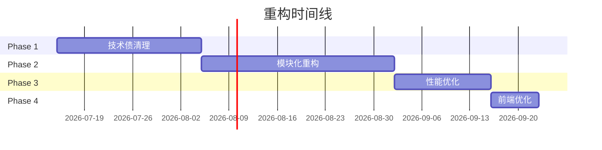

# Fund Agent 重构设计规格书

**版本**: 1.0
**日期**: 2026-07-14
**状态**: 待审批

---

## 1. 背景与目标

### 1.1 项目概述

Fund Agent (公开基金信息整理助手) 是一个全栈应用，结合确定性数据后端与 LangGraph QA 系统，为用户提供基金信息管理与问答服务。

### 1.2 重构动机

基于代码审查，发现以下核心问题：

| 类别 | 问题 | 影响 |
|------|------|------|
| **循环依赖** | `graph.model → tools → market_tools → briefing_service → graph.model` | 启动顺序敏感，难以测试 |
| **Session管理** | 两种模式并存（`owns` vs `Depends`） | 代码不一致，易出错 |
| **大文件** | `WatchlistDrawer.tsx` (1618行)、`repository.py` (1408行) | 难以维护 |
| **类型系统** | 多处 `Exception`、`any` 类型 | 类型安全不足 |
| **错误处理** | 30+ 处 `except Exception:` 无日志 | 调试困难 |
| **硬编码** | 绝对路径、魔数字符串 | 移植性差 |

### 1.3 重构目标

1. **可维护性**: 拆分大文件，建立清晰的模块边界
2. **可测试性**: 消除循环依赖，统一依赖注入
3. **可靠性**: 规范化错误处理，添加结构化日志
4. **性能**: 添加缓存层，优化数据库查询
5. **一致性**: 统一代码风格和架构模式

---

## 2. 重构策略

### 2.1 核心原则

- **渐进式重构**: 小步快跑，每阶段独立可测试
- **风险控制**: 每次改动后运行测试套件验证
- **向后兼容**: 保持 API 稳定，避免破坏性变更

### 2.2 实施阶段总览



---

## 3. Phase 1: 技术债清理

**时间**: 2-3 周
**风险等级**: 低

### 3.1 清理 module_briefing.py

**问题**: `module_briefing.py` (1075行) 与 `briefing_service.py` 功能重叠

**解决方案**:

1. 分析两个文件的职责边界
2. 提取 `BriefTypeProfile`、`ModuleEnvelope` 到 `backend/types/briefing.py`
3. 合并冗余代码

**改动文件**:
- 新建 `backend/types/__init__.py`
- 新建 `backend/types/briefing.py`
- 修改 `services/module_briefing.py` - 使用类型导入
- 修改 `services/briefing_service.py` - 使用类型导入

### 3.2 修复循环依赖

**问题**: 多模块间的循环依赖关系

```
backend.graph.model → tools → market_tools → briefing_service → backend.graph.model
```

**解决方案**: 引入依赖注入容器

```python
# 新文件: backend/core/di.py
class DIContainer:
    _model = None

    @classmethod
    def get_model(cls):
        if cls._model is None:
            from backend.graph.model import build_model
            cls._model = build_model()
        return cls._model
```

**改动文件**:
- 新建 `backend/core/__init__.py`
- 新建 `backend/core/di.py`
- 修改 `backend/services/briefing_service.py` - 使用 `DIContainer.get_model()`
- 修改 `backend/tools/market_tools.py` - 使用服务注入
- 修改 `backend/services/module_briefing.py` - 使用 `DIContainer.get_model()`

### 3.3 统一 Session 管理

**问题**: 两种 session 管理模式并存

**解决方案**: 创建统一上下文管理器

```python
# 新文件: backend/core/db.py
from contextlib import contextmanager
from backend.db.session import get_session

@contextmanager
def db_session():
    """统一 session 管理"""
    session = get_session()
    try:
        yield session
        session.commit()
    except Exception:
        session.rollback()
        raise
    finally:
        session.close()
```

**改动文件**:
- 新建 `backend/core/db.py`
- 逐个 service 迁移到统一上下文管理器（30+ 文件）
- 保留 `backend/api/deps.py` 旧方法以向后兼容

### 3.4 错误处理规范化

**解决方案**:

1. 创建业务异常类体系
2. 替换宽泛的 `except Exception:`
3. 添加结构化日志

```python
# 新文件: backend/core/exceptions.py
class FundAgentError(Exception):
    """基础异常类"""
    pass

class FundNotFoundError(FundAgentError):
    """基金不存在"""
    pass

class DataSourceError(FundAgentError):
    """数据源错误，可重试"""
    pass

class ValidationError(FundAgentError):
    """数据验证错误"""
    pass
```

**改动文件**:
- 新建 `backend/core/exceptions.py`
- 修改关键 service 文件，替换异常处理
- 添加日志记录（使用标准库 `logging`）

---

## 4. Phase 2: 模块化重构

**时间**: 3-4 周
**风险等级**: 中

### 4.1 拆分 Repository 层

**问题**: `repository.py` (1408行) 包含所有数据访问逻辑

**目标结构**:

```
backend/db/repositories/
├── __init__.py
├── fund_repo.py       # 基金相关 CRUD
├── watchlist_repo.py  # 自选股相关
├── market_repo.py     # 市场数据
├── briefing_repo.py   # 简报相关
├── knowledge_repo.py  # 知识库相关
└── base.py            # 公共基类
```

**迁移策略**:
1. 创建新的目录结构
2. 逐个函数迁移到对应文件
3. 在原 `repository.py` 中添加兼容性导入
4. 验证所有 import 正常工作后删除旧文件

### 4.2 拆分 Services 层

**问题**: `services/` 目录有 30+ 个文件，缺乏分组

**目标结构**:

```
backend/services/
├── __init__.py
├── fund/
│   ├── __init__.py
│   ├── fund_service.py
│   ├── diagnosis_service.py
│   └── what_if_service.py
├── watchlist/
│   ├── __init__.py
│   ├── watchlist_service.py
│   └── transaction_service.py
├── market/
│   ├── __init__.py
│   ├── market_service.py
│   ├── market_intel_service.py
│   └── market_evidence_service.py
├── briefing/
│   ├── __init__.py
│   └── briefing_service.py
├── knowledge/
│   ├── __init__.py
│   └── (现有 knowledge_* 文件)
└── shared/
    ├── __init__.py
    ├── db_retry.py
    └── scheduler_lock.py
```

### 4.3 前端组件拆分

**问题**: `WatchlistDrawer.tsx` (1618行) 是典型的 God Component

**目标结构**:

```
frontend/src/components/watchlist/
├── WatchlistDrawer.tsx          # 主容器（精简后 ~200行）
├── tabs/
│   ├── OverviewTab.tsx         # 概览 Tab
│   ├── TransactionsTab.tsx     # 交易记录 Tab
│   ├── PendingBuysTab.tsx      # 待购 Tab
│   └── InvestmentPlansTab.tsx # 定投计划 Tab
├── shared/
│   ├── HoldingSnapshot.tsx    # 持仓快照
│   ├── SummaryItem.tsx        # 汇总项
│   └── CheckboxField.tsx      # 复选框字段
└── index.ts                    # 统一导出
```

### 4.4 重组 market_sources

**问题**: 数据源适配器散落在 `services/market_sources/`

**目标结构**:

```
backend/integrations/
├── __init__.py
├── base.py                     # MarketSource 基类
├── akshare_adapter.py          # AKShare 适配器
├── cninfo.py                   # CNINFO 数据源
├── fred.py                     # FRED 数据源
├── cls_telegraph.py            # CLS 电报数据源
├── policy_page.py              # 政策页面数据源
└── registry.py                 # 源注册表
```

### 4.5 提取 Scheduler 逻辑

**问题**: `scheduler.py` 与业务服务紧耦合

**解决方案**:
1. 提取 Job 定义为数据类
2. 调度器只负责按计划执行
3. 具体业务逻辑委托给服务层

```python
# 新文件: backend/scheduler/jobs.py
from dataclasses import dataclass
from typing import Callable

@dataclass
class Job:
    name: str
    func: Callable
    trigger: str  # 'cron' | 'interval'
    **trigger_kwargs
```

### 4.6 清理 qa/page.tsx

**问题**: `qa/page.tsx` (667行) 同样是大组件

**目标结构**:

```
frontend/src/components/qa/
├── QAPage.tsx              # 主容器（精简后）
├── ChatThread.tsx          # 聊天线程
├── MessageBubble.tsx       # 消息气泡
├── ToolCallCard.tsx        # 工具调用卡片
└── StreamingIndicator.tsx  # 流式响应指示器
```

---

## 5. Phase 3: 性能优化

**时间**: 2 周
**风险等级**: 低

### 5.1 添加缓存层

**方案**: 使用内存缓存 + 可选 Redis

```python
# 新文件: backend/core/cache.py
from functools import lru_cache
from typing import TypeVar, Callable, Any
import time

T = TypeVar('T')

class TimedCache:
    def __init__(self, ttl_seconds: int = 300):
        self._cache: dict[str, tuple[Any, float]] = {}
        self._ttl = ttl_seconds

    def get(self, key: str) -> Any | None:
        if key in self._cache:
            value, timestamp = self._cache[key]
            if time.time() - timestamp < self._ttl:
                return value
            del self._cache[key]
        return None

    def set(self, key: str, value: Any) -> None:
        self._cache[key] = (value, time.time())
```

**应用场景**:
- `fund_service.py` 中的 `get_fund_summary()` - 5分钟缓存
- `market_service.py` 中的指数数据 - 1分钟缓存
- `knowledge_search_service.py` 中的嵌入向量 - 1小时缓存

### 5.2 数据库优化

**改动点**:
1. 分析慢查询（使用 `EXPLAIN ANALYZE`）
2. 添加必要索引
3. 批量 upsert 优化
4. 考虑历史数据归档策略

**关键索引**:
- `fund_nav`: `(fund_code, date)` 复合索引
- `watchlist`: `(user_id, fund_code)` 唯一索引
- `market_evidence`: `(source, published_at)` 索引

---

## 6. Phase 4: 前端优化

**时间**: 1 周
**风险等级**: 低

### 6.1 状态管理优化

**现状问题**: 手动 polling、手动 localStorage 管理

**解决方案**:
1. 使用 React Query 的 `refetchInterval` 替代手动 polling
2. 考虑使用 Zustand 统一客户端状态
3. 提取共享 query key 到常量

```typescript
// 新文件: frontend/src/lib/query-keys.ts
export const QueryKeys = {
  watchlist: ['watchlist'] as const,
  fund: (code: string) => ['fund', code] as const,
  portfolioPnl: () => ['portfolioPnl'] as const,
} as const;
```

### 6.2 类型系统完善

**改动点**:
1. 替换所有 `any` 类型
2. 添加 `error.ts` 统一错误类型
3. 使用 `satisfies` 替代部分 `as` 断言

```typescript
// 新文件: frontend/src/types/error.ts
export class APIError extends Error {
  constructor(
    message: string,
    public statusCode: number,
    public details?: unknown
  ) {
    super(message);
    this.name = 'APIError';
  }
}
```

---

## 7. 完整项目覆盖

### 7.1 后端模块覆盖

| 模块 | 原文件 | 计划改动 | 阶段 |
|------|--------|----------|------|
| **API Routes** | `api/routes/*.py` (9个) | 统一响应格式 | Phase 2 |
| **Services** | `services/*.py` (30+) | 按领域拆分 | Phase 2.2 |
| **Repository** | `db/repository.py` (1408行) | 拆分多个repo | Phase 2.1 |
| **Models** | `db/models.py` | 类型注解完善 | Phase 1.3 |
| **Graph/QA** | `graph/qa_graph.py` | 依赖注入解耦 | Phase 1.1 |
| **Briefing** | `briefing_service.py` | 合并module_briefing | Phase 1.0 |
| **Module Briefing** | `module_briefing.py` (1075行) | 清理/合并 | Phase 2.4 |
| **Market Sources** | `services/market_sources/` | 插件化 | Phase 2.5 |
| **Scheduler** | `scheduler.py` | 业务解耦 | Phase 2.6 |
| **Config** | `config/settings.py` | 无需改动 | - |
| **Tools** | `tools/*.py` | 依赖注入 | Phase 1.1 |

### 7.2 前端模块覆盖

| 模块 | 原文件 | 计划改动 | 阶段 |
|------|--------|----------|------|
| **WatchlistDrawer** | `components/WatchlistDrawer.tsx` (1618行) | 拆分 | Phase 2.3 |
| **QA Page** | `qa/page.tsx` (667行) | 拆分 | Phase 3.0 |
| **API Client** | `lib/api.ts` | 类型完善 | Phase 4.2 |
| **Components** | `components/ui/` | 统一规范 | Phase 4 |
| **State** | React Query + localStorage | 优化polling | Phase 4.1 |

---

## 8. 风险与缓解措施

| 风险 | 概率 | 影响 | 缓解措施 |
|------|------|------|----------|
| 重构破坏现有功能 | 中 | 高 | 每次改动后运行测试套件 |
| 循环依赖修复遗漏 | 低 | 高 | 使用 `importlib` 检查未解决的循环 |
| Session 管理遗漏 | 中 | 高 | 代码审查 + 端到端测试 |
| 前端拆分遗漏 import | 低 | 中 | 使用 IDE 的 Find References |
| 数据库索引遗漏 | 低 | 中 | 添加后验证查询计划 |

---

## 9. 验收标准

每阶段完成后必须满足：

### 9.1 测试验证

- [ ] 所有现有 pytest 测试通过
- [ ] 前端 `npm test` 通过（如果存在）
- [ ] 手动 smoke test 通过

### 9.2 代码质量

- [ ] 无新增 lint 错误
- [ ] 类型检查通过（mypy / tsc）
- [ ] 无循环导入警告

### 9.3 文档更新

- [ ] API 变更记录到 CHANGELOG
- [ ] 内部架构文档更新
- [ ] README 更新（如果需要）

---

## 10. 后续工作

完成重构后，建议考虑：

1. **监控体系**: 添加应用性能监控 (APM)
2. **CI/CD**: 完善自动化测试和部署流程
3. **文档生成**: 使用 APIFlask/Swagger 自动生成 API 文档
4. **指标体系**: 添加业务指标埋点

---

## 附录 A: 术语表

| 术语 | 定义 |
|------|------|
| DI Container | 依赖注入容器，统一管理服务实例 |
| God Component | 承担过多职责的大型组件 |
| 技术债 | 因快速迭代而积累的代码质量问题 |
| Smoke Test | 冒烟测试，快速验证基本功能 |

## 附录 B: 参考资料

- [SQLAlchemy 2.0 文档](https://docs.sqlalchemy.org/en/20/)
- [FastAPI 最佳实践](https://fastapi.tiangolo.com/tutorial/)
- [React Query 文档](https://tanstack.com/query/latest)
- [Martin Fowler - 重构](https://martinfowler.com/books/refactoring.html)
